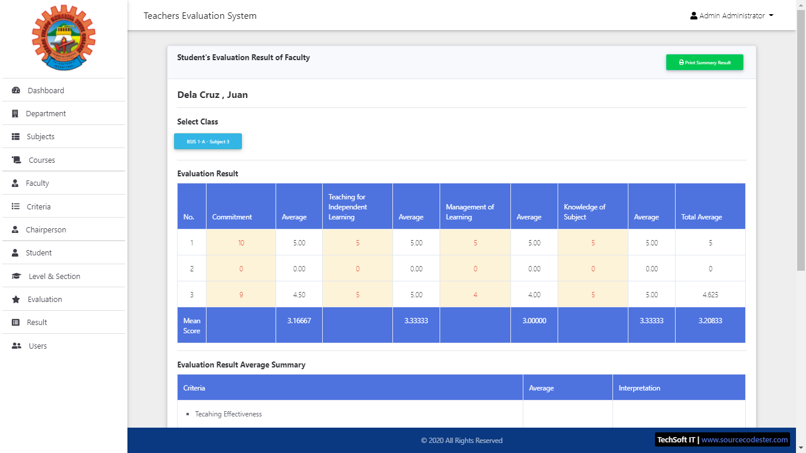

# Faulty Evaluation System using PHP/CodeIgniter

### Description

This is a Faulty Evaluation System is PHP Project that is written in CodeIgniter PHP Framework. This system has 3 types of users which are the Admin, Chairperson, and Student. The system's main purpose is to provide the Students and Chairpersons an online evaluation for the Subject Faculties.This Faulty Evaluation System is a Capstone Project of CHMSC's (Carlos Hilado Memorial State College) student. This project was developed using PHP/CodeIgniter, HTML, MySQL Database, CSS, and MDBootsrap for the template and design.

### Features

<strong>Admin</strong>
<ul>
  <li><strong>Manage Departments</strong></li>
  <li><strong>Manage Subjects</strong></li>
  <li><strong>Manage Courses</strong></li>
  <li><strong>Manage Faculties</strong></li>
  <li><strong>Manage Chairpersons</strong></li>
  <li><strong>Manage Evaluation Criteria</strong></li>
  <li><strong>Manage Level and Sections</strong></li>
  <li><strong>Manage Evaluations List</strong></li>
  <li><strong>Manage Evaluation's Forms</strong></li>
  <li><strong>Manage Restrictions</strong></li>
  <li><strong>Generate Evaluation Results</strong></li>
  <li><strong>Manage Users</strong></li>
</ul>

<strong>Students/Chairpersons</strong>
<ul>
  <li><strong>Evaluate the Faculty per Subject Handles</strong></li>
</ul>

Visit [sourcecodester.com](https://www.sourcecodester.com/php/14710/faulty-evaluation-system-using-phpcodeigniter-source-code.html) for more detailed information about this project.

### Website Info

| Title | Faulty Evaluation System using PHP/CodeIgniter with Source Code |
|:--|:--|
| Website | [www.sourcecodester.com](https://www.sourcecodester.com) |
| Link | https://www.sourcecodester.com/php/14710/faulty-evaluation-system-using-phpcodeigniter-source-code.html |
| Language | PHP |
| Uploader/Developer | [oretnom23](https://www.sourcecodester.com/users/tips23) |
